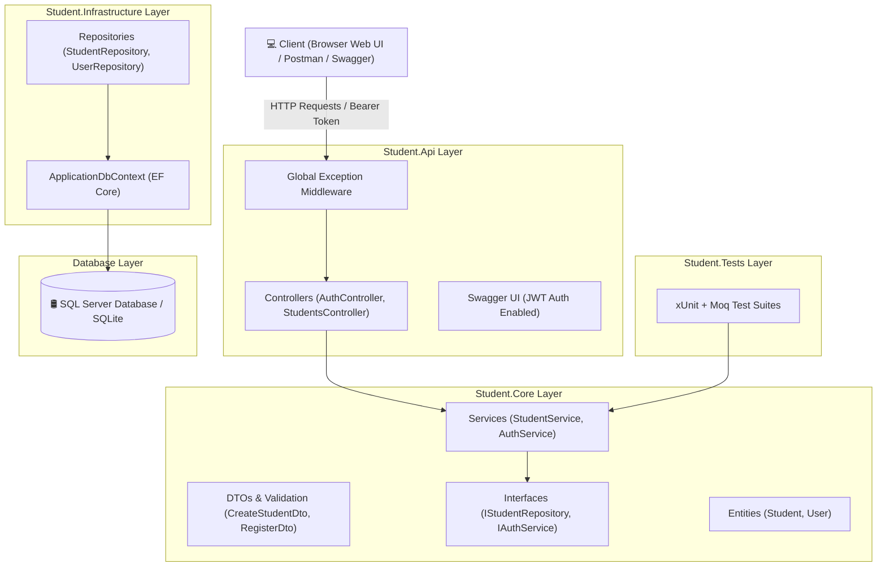

# Student Management System - Full Stack .NET Core Solution

> **Zest India IT Pvt Ltd - Technical Assignment Submission**  
> A production-ready, clean-architecture Student Management System built using **ASP.NET Core 8 Web API**, **Entity Framework Core (SQL Server)**, **JWT Authentication**, **Serilog Logging**, **Global Exception Middleware**, **xUnit Unit Tests**, **Docker Containerization**, and a modern **Glassmorphic Frontend UI**.

---

## 🌟 Solution Overview & Highlights

- **Architecture**: Clean 4-Layer Architecture (`Student.Core`, `Student.Infrastructure`, `Student.Api`, `Student.Tests`).
- **Database**: SQL Server Entity Framework Core with automatic migrations and SQLite fallback for instant local evaluation.
- **Security**: JWT Bearer token authentication with BCrypt password hashing.
- **Error Handling**: Custom `ExceptionMiddleware` translating exceptions into standardized `ApiResponse<T>` JSON objects with proper HTTP status codes.
- **Logging**: Integrated Serilog with simultaneous Console and Daily Rolling File Sinks (`Logs/student-system-.log`).
- **Swagger Documentation**: OpenApi Swagger UI with built-in JWT Bearer token authorization header input.
- **Bonus 1 - Unit Testing**: 14 test suites using xUnit, Moq, FluentAssertions, and EF Core InMemory provider covering Service & Controller layers.
- **Bonus 2 - Docker**: Multi-stage `Dockerfile` and `docker-compose.yml` for SQL Server 2022 + API containerization.
- **Bonus 3 - Modern Web UI**: Responsive glassmorphic dashboard with live data metrics, JWT login/register modal, search/filter, and full CRUD operations.

---

## 🏛️ System Architecture



---

## 🗄️ Database Schemas

### 1. `Students` Table
| Column Name | Data Type | Constraints | Description |
|---|---|---|---|
| `Id` | `int` | Primary Key, Auto-increment | Unique Student ID |
| `Name` | `nvarchar(100)` | Required | Full Name of Student |
| `Email` | `nvarchar(150)` | Required, Unique Index | Student Email Address |
| `Age` | `int` | Required (1 - 120) | Age in years |
| `Course` | `nvarchar(100)` | Required | Enrolled Course |
| `CreatedDate` | `datetime2` | Required, Default GETUTCDATE() | Timestamp of creation |

### 2. `Users` Table (JWT Auth)
| Column Name | Data Type | Constraints | Description |
|---|---|---|---|
| `Id` | `int` | Primary Key, Auto-increment | Unique User ID |
| `Username` | `nvarchar(50)` | Required, Unique Index | Account Username |
| `Email` | `nvarchar(150)` | Required, Unique Index | Account Email |
| `PasswordHash` | `nvarchar(max)` | Required | BCrypt Password Hash |
| `Role` | `nvarchar(20)` | Required | Role (`Admin` / `User`) |
| `CreatedDate` | `datetime2` | Required | Registration Timestamp |

---

## 🚀 Quick Start & Local Setup

### Prerequisites
- [.NET 8 SDK or .NET 10 SDK](https://dotnet.microsoft.com/download)
- [SQL Server LocalDB / Express](https://www.microsoft.com/sql-server/) (Optional: SQLite fallback automatically works out of the box!)
- [Docker Desktop](https://www.docker.com/products/docker-desktop/) (Optional for container running)

### Option 1: Run Web API & Web UI directly via .NET CLI

1. **Clone the repository**:
   ```bash
   git clone <YOUR_REPOSITORY_LINK>
   cd StudentmanagementSystem
   ```

2. **Restore dependencies**:
   ```bash
   dotnet restore
   ```

3. **Run the API application**:
   ```bash
   cd Student.Api
   dotnet run
   ```

4. **Access Applications in Browser**:
   - **Interactive Web UI**: `https://localhost:7045` or `http://localhost:5045`
   - **Swagger API Documentation**: `https://localhost:7045/swagger`

---

## 🔐 JWT Authentication & Swagger Guide

### Demo Admin Credentials
- **Username**: `admin`
- **Password**: `Admin@123`

### Step-by-Step Swagger Authentication:
1. Open `https://localhost:7045/swagger`.
2. Expand `POST /api/Auth/login` and click **Try it out**.
3. Pass the login request payload:
   ```json
   {
     "usernameOrEmail": "admin",
     "password": "Admin@123"
   }
   ```
4. Copy the generated `token` string from the JSON response.
5. Click the **Authorize 🔓** button at the top right of Swagger UI.
6. Enter `Bearer <YOUR_TOKEN_HERE>` in the Value box and click **Authorize**.
7. All protected `/api/students` endpoints are now fully authorized!

---

## 🧪 Running Unit Tests

The test suite includes **14 Unit Tests** covering the core domain service logic, validation edge cases, conflict scenarios, and controller endpoints using xUnit, Moq, and FluentAssertions.

To run the unit tests:
```bash
dotnet test
```

### Sample Output:
```text
Passed!  - Failed: 0, Passed: 14, Skipped: 0, Total: 14, Duration: 1 s - Student.Tests.dll (net8.0)
```

---

## 🐳 Docker Deployment

The application is containerized with Docker & Docker Compose including SQL Server 2022 and ASP.NET Core API.

### Run with Docker Compose:
```bash
docker-compose up --build
```

- **API Endpoint**: `http://localhost:5000`
- **Swagger Documentation**: `http://localhost:5000/swagger`
- **SQL Server Port**: `1433` (Password: `YourPassword123!`)

---

## 📡 API Endpoint Reference

### Auth Endpoints (`/api/auth`)
| Method | Endpoint | Access | Description |
|---|---|---|---|
| `POST` | `/api/auth/register` | Public | Register a new user |
| `POST` | `/api/auth/login` | Public | Authenticate & retrieve JWT token |

### Student Endpoints (`/api/students`)
| Method | Endpoint | Access | Description |
|---|---|---|---|
| `GET` | `/api/students` | Protected (`Bearer`) | Get all students (Supports `searchTerm` & `course`) |
| `GET` | `/api/students/{id}` | Protected (`Bearer`) | Get student details by ID |
| `POST` | `/api/students` | Protected (`Bearer`) | Create a new student record |
| `PUT` | `/api/students/{id}` | Protected (`Bearer`) | Update student details |
| `DELETE` | `/api/students/{id}` | Protected (`Bearer`) | Delete student record |

---

## 📋 Standardized API Response Format

All API endpoints return a uniform response structure:

```json
{
  "success": true,
  "message": "Student created successfully",
  "data": {
    "id": 1,
    "name": "Aarav Sharma",
    "email": "aarav.sharma@example.com",
    "age": 21,
    "course": "Computer Science",
    "createdDate": "2026-01-15T00:00:00Z"
  },
  "errors": [],
  "statusCode": 201
}
```

---

## 📁 Repository Structure

```
StudentmanagementSystem/
├── Student.Core/                   # Domain Entities, DTOs, Interfaces, Service Logic
│   ├── Common/                     # ApiResponse<T>
│   ├── DTOs/                       # StudentDtos, AuthDtos
│   ├── Entities/                   # Student, User
│   ├── Exceptions/                 # Custom Exceptions (NotFound, Conflict)
│   ├── Interfaces/                 # Repository & Service Interfaces
│   └── Services/                   # StudentService, AuthService, JwtTokenGenerator
├── Student.Infrastructure/         # Data Access & Entity Framework Core
│   ├── Data/                       # ApplicationDbContext & Seed Data
│   └── Repositories/               # Generic & Specialized Repositories
├── Student.Api/                    # Presentation Layer (ASP.NET Core Web API)
│   ├── Controllers/                # AuthController, StudentsController
│   ├── Middleware/                 # Global ExceptionMiddleware
│   └── wwwroot/                    # Modern Glassmorphic Web UI
├── Student.Tests/                  # Unit Test Suite (xUnit, Moq, FluentAssertions)
├── Dockerfile                      # Multi-stage Docker Build file
├── docker-compose.yml              # Container setup for SQL Server + API
└── README.md                       # Project Documentation
```

---

Submitted by Candidate for **Zest India IT Pvt Ltd Technical Assignment**.
